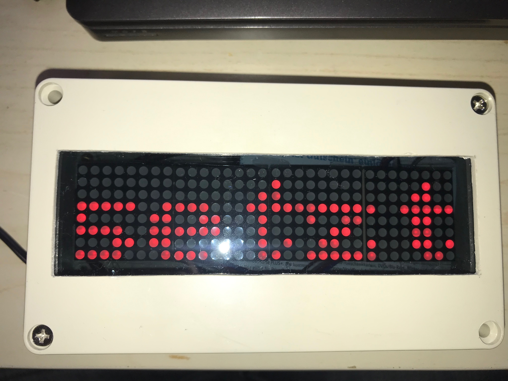
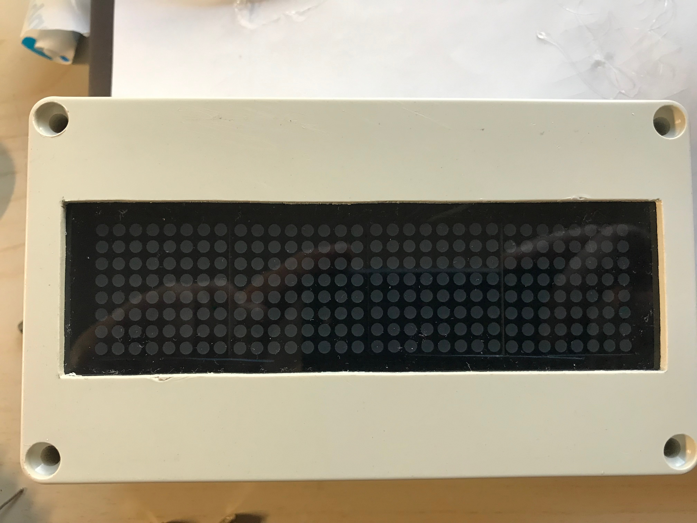
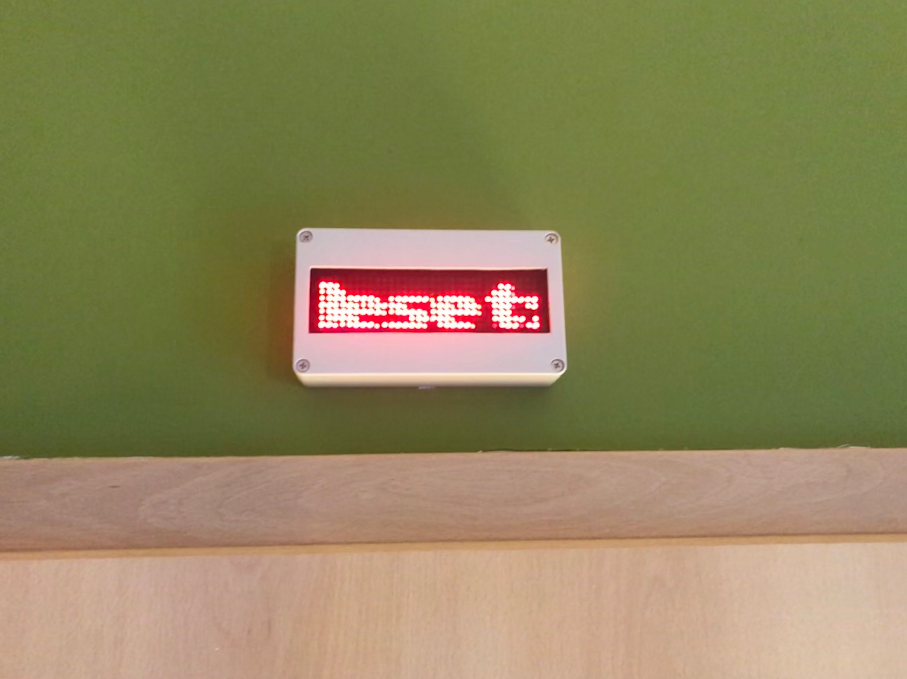
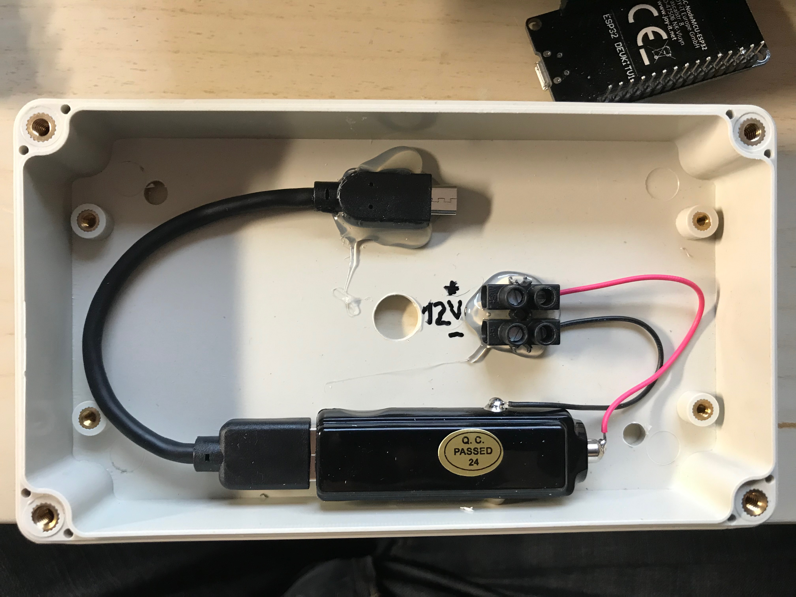
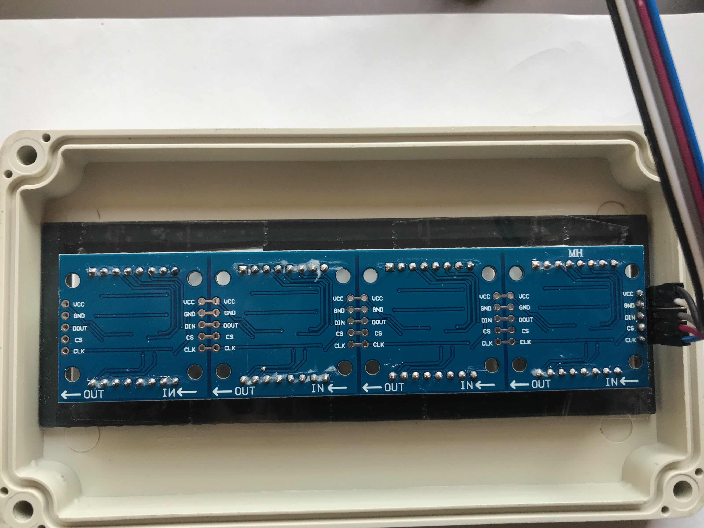
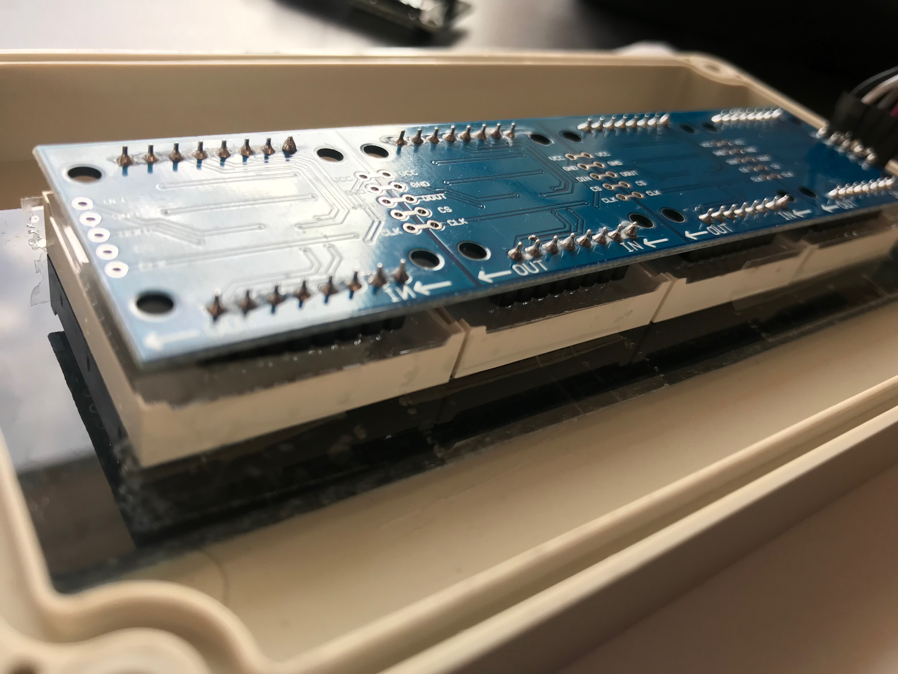
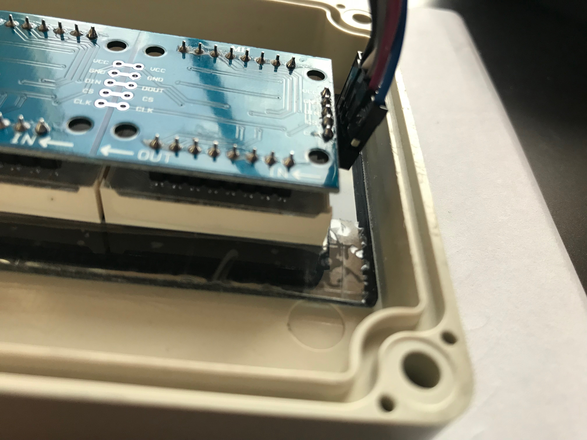
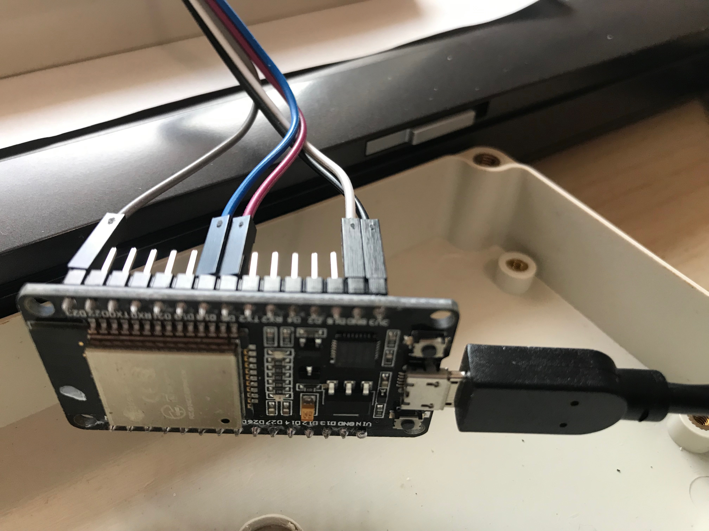
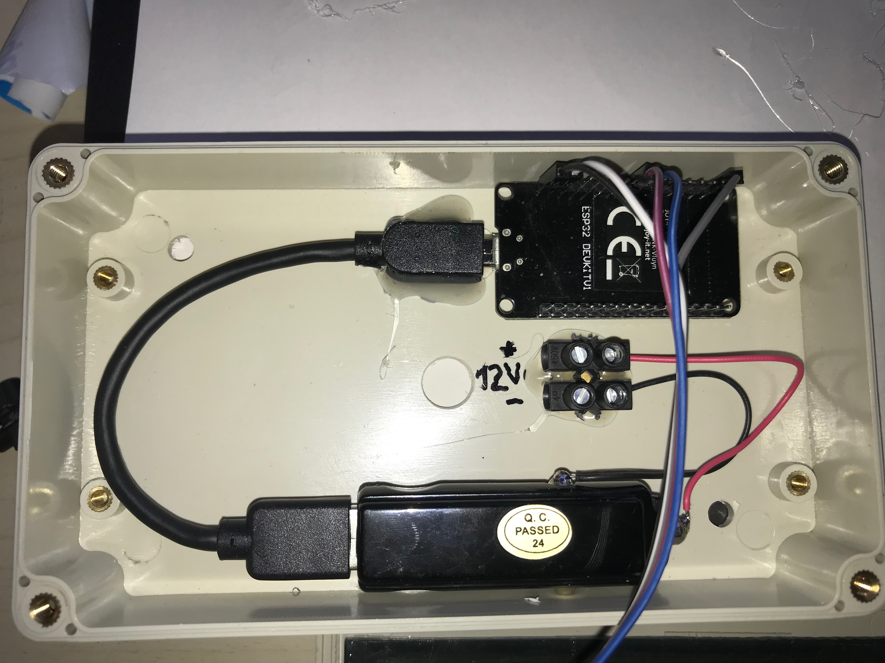

# ESP32-LED-Matrix-SPI-MQTT
MQTT WiFi Display with ESP32 and MAX7219 LED Matrix

I use this unit to display the occupancy status of the bath rooms. Presence detectors and light status are the inputs. A script sets the string to be displayed to the MQTT topic. In case of no presence the string is cleared. Delay from setting the string in MQTT to appearing at the display is 1-3 seconds.

Power consumption of the whole unit (WiFi active, MQTT subscribed) is 0.7 Watts with empty display and 1.2 Watts with scrolling text and brightness set to 3 of 15 (which is bright enough for my usage). Measured with a 230V power meter and USB charger supplying the power to the unit.
Powering the display with 5 Volts is very bright. I tried it and decided to use the 3.3 Volts.

In action:

Switched off:

Wall mounted:

ESP32 DevKitV1 removed for programming (it is only fixed by the MicroUSB connector):

Acrylic glass is 5x14.8cm and glued (with superglue) to the front case part. The display unit is fixed with TESA to the glass. Cutout from front case is 4x14cm.

The onboard 5V to 3.3V converter is used for display power supply (using the 3.3V "Input" of the DevBoard as output).

A lot of hot glue used. The car USB adapter is also attached with hot glue.

# Parts List
- 8x32 RGB LED matrix module with MAX7219 (https://www.ebay.de/itm/Dot-Matrix-Modul-8x8-Display-Arduino-4-Matrix-MAX7219-Led-Lcd-Raspberry-Pi/253070191854)
- ESP32 NodeMCU dev. board (https://www.pollin.de/p/joy-it-esp32-node-mcu-modul-810873)
- 12V car USB converter (https://www.pollin.de/p/kfz-usb-lader-tabtools-5-v-2-1-a-351769)
- 15cm MicroUSB cable (https://www.pollin.de/p/usb-2-0-kabel-usb-a-micro-usb-0-15-m-722505)
- Case (https://www.pollin.de/p/modulgehaeuse-abs-158x90x40-mm-ip65-lichtgrau-460313)
- Acrylic class with 30 % transparency (https://www.ebay.de/itm/192128044439)

# Dependencies
- esp32-led-matrix-v (subfolder, forked from https://github.com/nhatuan84/esp32-led-matrix)
Difference to the original "esp32-led-matrix" library is the scroll direction. There seems to exist different MAX7219 displays with horizontal and vertical scroll directions. Mine was vertical.
